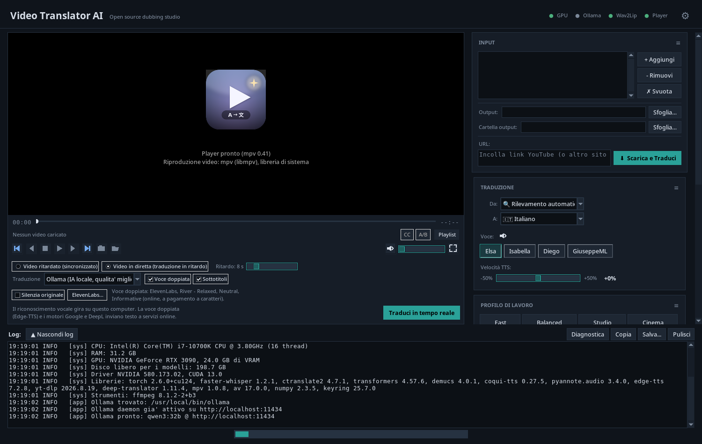

# 🎬 Video Translator AI

[Angielski](../../README.md) | [Wszystkie tłumaczenia](README.md)

**Przeczytaj tę stronę w:** [Bahasa Indonesia](README.id.md) · [Čeština](README.cs.md) · [Dansk](README.da.md) · [Deutsch](README.de.md) · [Español](README.es.md) · [Français](README.fr.md) · [Italiano](README.it.md) · [Magyar](README.hu.md) · [Nederlands](README.nl.md) · [Norsk](README.no.md) · [Polski](README.pl.md) · [Português](README.pt.md) · [Română](README.ro.md) · [Suomi](README.fi.md) · [Svenska](README.sv.md) · [Tiếng Việt](README.vi.md) · [Türkçe](README.tr.md) · [Ελληνικά](README.el.md) · [Русский](README.ru.md) · [Українська](README.uk.md) · [العربية](README.ar.md) · [हिन्दी](README.hi.md) · [中文](README.zh.md) · [日本語](README.ja.md) · [한국어](README.ko.md)

[](https://github.com/HeartB1t/VideoTranslatorAI/actions/workflows/tests.yml)

Narzędzie do kopiowania głosu wideo oparte na sztucznej inteligencji, które automatycznie transkrybuje, tłumaczy i ponownie kopiuje filmy na 26 języków, z lokalnymi opcjami przetwarzania i domyślnie nie wymagając kluczy API. Rozpoznawanie mowy Whisper działa lokalnie; Edge-TTS, Google Translate i DeepL wymagają połączenia z Internetem. Funkcje opcjonalne (DeepL, identyfikacja osób mówiących (diaryzacja)) mogą wymagać klucza API lub tokena dostępu.



> **v2.0** - pakiet modułowy, lokalne tłumaczenie Ollama, orkiestracja profilu jakości, instalowalne metadane Pythona i opcjonalne testy integracji z rzeczywistymi modelami. Zobacz [Wersje GitHub](https://github.com/HeartB1t/VideoTranslatorAI/releases) i historię zatwierdzeń, aby uzyskać pełną listę zmian.

> **v2.1.0** - instalator Windows wzmocniony (środowisko uruchomieniowe Microsoft Visual C++, przejrzysty dziennik instalacji, samoaktualizacja z Wersji GitHub), czystsze dzienniki (jeden postępujący pasek postępu na pobieranie), programowe dekodowanie wideo na komputerach bez GPU oraz podniesione przyciski transportu. Zobacz [Wersje GitHub](https://github.com/HeartB1t/VideoTranslatorAI/releases).

## Jak to działa

1. **Transkrypcja** - [faster-Whisper](https://github.com/SYSTRAN/faster-whisper) transkrybuje dźwięk (przyspieszony przez GPU)
2. **Separacja głosu/muzyki** - [Demucs](https://github.com/facebookresearch/demucs) izoluje wokal od muzyki w tle
3. **Tłumaczenie** - MarianMT (lokalnie, offline), Google Translate, DeepL Free lub **Ollama LLM** (Qwen3, zwięzłe tłumaczenia uwzględniające sloty)
4. **identyfikacja mówiących osób (diaryzacja)** *(opcjonalnie)* - [pyannote-audio](https://github.com/pyannote/pyannote-audio) identyfikuje, kto mówi w każdym segmencie
5. **dubbing głosu** - [Edge-TTS](https://github.com/rany2/edge-tts) (ponad 400 głosów) lub [Coqui XTTS v2](https://github.com/coqui-ai/TTS) (klonowanie głosu, dla każdego mówcy w rozmowie)
6. **Miksowanie** - dubbingowany głos zmieszany z oryginalną muzyką w tle
7. **Normalizacja** - końcowy dźwięk znormalizowany do -23 LUFS (standard transmisji EBU R128)
8. **Lip Sync** *(opcjonalnie)* - [Wav2Lip](https://github.com/Rudrabha/Wav2Lip) synchronizuje ruchy ust z kopiowanym dźwiękiem

## Funkcje

- 🖥️ Tematyczny GUI (Tkinter) - nie jest wymagana linia poleceń; Motywy Graphite, Slate, Light i Neon, kolory akcentów, rozmiar tekstu i panele ustawień można zmieniać poprzez przeciąganie
- 🕹️ **Skórki** - zabawne style w ustawieniach: Dex i Handheld przypominają kieszonkową konsolę (pikselowa czcionka, grube ramki), CRT i CRT Amber monitor fosforowy z lat 80., z krzywizną i liniami skanowania także na wideo
- 🔊 **Posłuchaj, zanim wybierzesz** - ikona głośnika obok głosu odtwarza przykładowe zdanie w języku docelowym (Edge-TTS) lub darmową próbkę głosu ElevenLabs
- 🌍 **26 języków docelowych** z wieloma głosami w każdym języku
- 🌐 **UI w 26 językach** - sam interfejs dostosowuje się do Twojego języka
- 🎬 **Obsługa YouTube i adresów URL** - wklej dowolny link do YouTube i tłumacz bezpośrednio (obsługiwane przez yt-dlp)
- ▶️ **Zintegrowany odtwarzacz wideo** (libmpv/mpv) - oznaczone kolorami elementy sterujące transportem, lista odtwarzania, dźwięk oryginalny A/B a dźwięk z dubbingiem, przełączanie napisów, migawka, pełny ekran, otwarty folder
- ⏱️ **Tłumaczenie w czasie rzeczywistym** - oglądaj plik lokalny lub link do wideo na żądanie z przetłumaczonymi napisami i suwakiem opóźnienia; silniki MarianMT / Google / DeepL / Ollama. Dubbing używa Edge-TTS lub opcjonalnie głosów ElevenLabs przez drugą instancję mpv; nakładające się zdania czekają, przyspieszają lub cichną. Trwające transmisje na żywo nie są jeszcze obsługiwane.
- 🎵 Separacja głosu/muzyki za pomocą Demucs (zachowuje muzykę w tle)
- 🔇 **Wycisz oryginalny dźwięk**, dostępny przed i w trakcie tłumaczenia na żywo, wycisza ścieżkę dźwiękową filmu, jednocześnie utrzymując słyszalność przetłumaczonego głosu. Wyłącz tę opcję, aby przywrócić oryginalny dźwięk; resetuje się po zakończeniu sesji na żywo.
- 🧠 **MarianMT** - w pełni lokalne tłumaczenie neuronowe offline (Helsinki-NLP, brak limitów liczby żądań, brak klucza API)
- 🤖 **Tłumaczenie Ollama LLM** *(nowość w wersji 2.0)* - lokalny LLM (Qwen3, Llama, Mistral) tworzący zwięzłe tłumaczenia uwzględniające sloty dla naturalnego dubbingu głosowego, automatycznie wykrywa/instaluje/uruchamia/pobiera model przy pierwszym użyciu
- 🎙️ **Klonowanie głosu** - Coqui XTTS v2 klonuje osobę mówiącą oryginalnym głosem w języku docelowym (model ~1,8 GB), z adaptacyjną szybkością dla każdego segmentu i wieloziarnistą próbą w przypadku halucynacji
- 👥 **identyfikacja mówiących osób (diaryzacja)** - pyannote-audio 3.1 identyfikuje wiele mówiących osób; XTTS klonuje każdy głos osobno
- 💋 **Lip Sync** - Wav2Lip GAN synchronizuje ruchy ust z dubbingowanym dźwiękiem (model ~416 MB)
- 🔊 **Normalizacja dźwięku** - automatyczna -23 LUFS normalizacja głośności (EBU R128)
- ✏️ Edytor napisów - przejrzyj i popraw napisy przed dubbingiem głosowym
- 📦 Przetwarzanie wsadowe - tłumacz wiele filmów lub adresów URL jednocześnie
- ⚡ Przyspieszenie GPU poprzez CUDA (automatycznie wraca do procesora)
- 📄 Opcjonalny eksport napisów `.srt`
- 🔁 **DeepL Free** silnik tłumaczący (opcjonalnie - 500 tys. znaków/miesiąc, wymaga darmowego klucza API)
- 🔧 **Automatyczna instalacja** - brakujące pakiety Pythona i ffmpeg są instalowane automatycznie przy pierwszym uruchomieniu
- 🧮 **Modele dla tego komputera** - wykrywa procesor, RAM, GPU, VRAM i wolne miejsce na dysku, poleca modele rozpoznawania mowy, tłumaczenia i głosu pod kątem szybkości, równowagi lub jakości, pobiera i sprawdza modele Whisper oraz mierzy je na twoim własnym wideo
- 🗣️ **Głosy ElevenLabs** *(opcjonalne, online, płatne)* - naturalne wielojęzyczne głosy do dubbingu na żywo z twoim własnym kluczem API; gdy klucz lub limit zawiedzie, przejmuje Edge-TTS
- 🧬 **Klonowanie głosu z Voicebox** *(opcjonalne)* - klonuje głos mówiącego przez osobny lokalny serwer [Voicebox](https://github.com/jamiepine/voicebox); gdy nie działa, wideo używa Edge-TTS

## Obsługiwane języki

Arabski, chiński, czeski, duński, holenderski, angielski, fiński, francuski, niemiecki, grecki, hindi, węgierski, indonezyjski, włoski, japoński, koreański, norweski, polski, portugalski, rumuński, rosyjski, hiszpański, szwedzki, turecki, ukraiński, wietnamski

## Katalog głosów

Katalog głosowy Edge-TTS jest zdefiniowany w `LANGUAGES` w górnej części `video_translator_gui.py`. Słownik ten jest źródłem prawdy dla nazw języków docelowych, przycisków opcji głosu GUI i głosu zastępczego CLI, gdy pominięto `--voice`.

Notatki Claude/konserwacji projektu odzwierciedlają tę lokalizację w `CLAUDE.md` pod **Voice Catalog Source Of Truth**, więc przyszli agenci kodu będą wiedzieć, gdzie aktualizować głosy i gdzie plik README wskazuje użytkownikom.

## Silniki tłumaczeniowe

| Silnik | Konfiguracja | Limity | Jakość |
|--------|-------|--------|---------|
| **Google Translate** *(domyślnie)* | Żadne | Nieoficjalne skrobanie - może zostać ograniczone w przypadku dużych filmów | ★★★★ |
| **MarianMT** | Brak - pobiera ~298 MB na parę językową przy pierwszym użyciu | Brak - po pobraniu całkowicie offline | ★★★★ |
| **DeepL Free** | Darmowy klucz API na [deepl.com](https://www.deepl.com/pro-api) | 500 tys. znaków/miesiąc | ★★★★★ |
| **Ollama LLM** *(zalecane do dubbingu głosowego - nowość w wersji 2.0)* | Instalowany automatycznie przy pierwszym użyciu (model ~1 GB Ollama + 5 GB) | Brak - w pełni lokalny | ★★★★★ |

> **MarianMT** używa modeli [Helsinki-NLP/opus-mt](https://huggingface.co/Helsinki-NLP), przechowywanych lokalnie w pamięci podręcznej po pierwszym pobraniu. Wymaga wyraźnego języka źródłowego (automatyczne wykrywanie nie jest obsługiwane - wybierz język źródłowy ręcznie). Wymagane pakiety Pythona (`sacremoses`, `sentencepiece`) są instalowane automatycznie przy pierwszym wyborze, jeśli ich brakuje.

> **Ollama LLM** *(nowość w wersji 2.0)* to zalecany silnik do dubbingu głosowego, ponieważ tworzy tłumaczenia uwzględniające docelowy przedział czasowy. Tam, gdzie MarianMT tłumaczy dosłownie i tworzy język włoski/hiszpański/francuski o ~25% dłuższy niż angielski (wymuszając kompresję słyszalnego dźwięku w TTS), LLM jest proszony o zachowanie zwięzłości i naturalności każdego segmentu w przypadku mówienia, osiągając typowy współczynnik char-raportu wynoszący 0,85-0,95 względem źródła. Domyślny model to `qwen3:8b` (5,2 GB na dysku, ~6 GB VRAM); `qwen3:4b` (~3 GB) to opcja lekka, `qwen3:14b` to opcja wyższej jakości. Potok automatycznie wykrywa plik binarny Ollama, automatycznie instaluje go za pośrednictwem oficjalnego instalatora przy pierwszym użyciu (z wyskakującym okienkiem zgody), uruchamia demona i pobiera wybrany model - nie jest wymagana ręczna konfiguracja. Automatycznie przełącza się na Google Translate, jeśli czegoś brakuje.

## Klonowanie głosu (XTTS v2)

Po włączeniu aplikacja wyodrębnia głos mówiącego z oryginalnego filmu i wykorzystuje go jako odniesienie do klonowania głosu w języku docelowym.

- Obsługiwane języki: AR, ZH, CS, DE, EN, ES, FR, HI, HU, IT, JA, KO, NL, PL, PT, RU, TR (17/26)
- W przypadku pozostałych 9 języków Edge-TTS jest automatycznie używany jako język zastępczy
- Model (~1,8 GB) pobierany automatycznie przy pierwszym użyciu do `~/.local/share/tts/`
- **Odniesienie filtrowane przez VAD** (wersja 1.4): 10-15 s ciągłej mowy wybranej z oryginalnego dźwięku za pośrednictwem [silero-vad](https://github.com/snakers4/silero-vad) w celu lepszej jakości klonowania głosu
- **Szybkość generowania** konfigurowalna (`xtts_speed`, domyślnie `1.25`): wyższe wartości redukują artefakty kompresji dźwięku po przetwarzaniu, gdy przetłumaczony tekst jest dłuższy niż szczelina źródłowa. Dostrój przez `~/.config/videotranslatorai/config.json` lub CLI `--xtts-speed`
- Działa na CUDA lub CPU

## identyfikacja osób mówiących (diaryzacja) (pyannote-audio)

Po włączeniu aplikacja identyfikuje, kto mówi w każdym segmencie. W połączeniu z funkcją klonowania głosu głos każdego mówcy jest klonowany osobno - idealne rozwiązanie do wywiadów, podcastów i filmów wieloosobowych.

- Wymaga darmowego [tokena HuggingFace](https://huggingface.co/settings/tokens) (jednorazowa rejestracja)
- **Token bezpiecznie przechowywany** (v1.4) poprzez bazę kluczy systemu operacyjnego: Windows Credential Manager, macOS Keychain, Linux Secret Service. Automatyczna migracja z poprzedniej pamięci JSON w postaci zwykłego tekstu
- Po pierwszym pobraniu działa w pełni offline
- Model: `pyannote/speaker-diarization-3.1`

## Synchronizacja ust (Wav2Lip)

Po włączeniu aplikacja wykorzystuje technologię Wav2Lip GAN do synchronizacji ruchów ust osoby badanej z dubbingowanym dźwiękiem - osoba wydaje się mówić w przetłumaczonym języku.

- Model (~416 MB) i repozytorium automatycznie sklonowane przy pierwszym użyciu do `~/.local/share/wav2lip/`
- Działa na CUDA (zalecane) lub CPU
- Znacząco wydłuża czas przetwarzania
- Działa najlepiej w przypadku filmów z pojedynczą, wyraźnie widoczną twarzą

## Modele dla tego komputera

Ustawienia zaawansowane > Model > **Modele dla tego komputera** otwiera okno, które odczytuje sprzęt (procesor, RAM, GPU i dostępną VRAM, wolne miejsce na dysku) bez żadnych zmian i poleca jeden model na każdy etap: rozpoznawanie mowy dla plików i na żywo, tłumaczenie i głos.

- Wybierz **Szybkość**, **Zrównoważony** lub **Jakość**: każde zalecenie podaje swoje powody.
- Pozostałe opcje nadal można wybrać, a każda ma ocenę dla tego komputera: mieści się, na granicy, za duży, za mało miejsca lub usługa online.
- **Pobierz** pobiera brakujący model Whisper z paskiem postępu i przyciskiem Anuluj oraz sprawdza każdy plik sumami kontrolnymi Hugging Face; nic nie jest pobierane przed kliknięciem.
- **Test wydajności** mierzy wybrany model na wczytanym wideo (wczytanie, pierwsze zdanie, szybkość); dźwięk nigdy nie opuszcza komputera.
- **Zastosuj** ustawia modele; **Przywróć poprzednie** przywraca wcześniejszy wybór. Karty NVIDIA są używane przez CUDA; karty AMD (ROCm) i Apple są pokazywane, ale tam modele mowy działają na procesorze.

## Voicebox (klonowanie głosu przez lokalny serwer)

[Voicebox](https://github.com/jamiepine/voicebox) (MIT) to osobny program klonujący głosy. Zainstaluj go i uruchom samodzielnie; ta aplikacja tylko wywołuje jego lokalne API i nigdy go nie instaluje.

- Ustawienia zaawansowane > Klonowanie głosu > **Voicebox**: ustaw adres (domyślnie `http://127.0.0.1:17493`), silnik (domyślnie `chatterbox`) i naciśnij **Sprawdź**.
- Dla każdego wideo klonowany jest tymczasowy głos z czystej próbki mówiącego (jeden na mówcę przy rozpoznawaniu mówców), a potem usuwany.
- Akceptowany jest tylko adres na tym komputerze, bo API Voicebox nie ma uwierzytelniania.
- Jeśli Voicebox nie odpowiada lub nie obsługuje języka docelowego, wideo jest dubbingowane przez Edge-TTS.

## Wymagania

- Python 3.10+ (instalator Windows automatycznie uruchamia wersję 3.11.9)
- Windows 10/11 (x64), Linux lub macOS
- **Zdecydowanie zalecany procesor graficzny NVIDIA** - patrz tabela GPU poniżej
- 20 GB wolnego miejsca na dysku do pełnej instalacji (PyTorch CUDA, Whisper Large-v3, XTTS, Wav2Lip)

> **ffmpeg i wszystkie pakiety Pythona są instalowane automatycznie** przy pierwszym uruchomieniu, jeśli ich brakuje. Nie jest wymagana ręczna konfiguracja.

**Opcjonalna zależność systemowa** - `rubberband-cli` (Linux: `sudo apt install rubberband-cli`, macOS: `brew install rubberband`). Po zainstalowaniu służy do rozciągania czasu z zachowaniem wysokości tonu w paśmie jakości kontrolowanym przez profil (domyślnie 1,15-1,50, do 1,65 w przypadku treści twardych), usuwając resztkowy efekt „wiewiórki” na sklonowanych głosach XTTS. Bez niego potok działa niezmieniony (automatyczny powrót do ffmpeg `atempo`). Profile jakości preferują teraz dodatkowe, krótkie próby tłumaczenia zamiast ekstremalnego przyspieszenia dźwięku.

### Wsparcie GPU

Potok wykorzystuje pięć komponentów akcelerowanych przez GPU (faster-whisper, Demucs, XTTS, Wav2Lip, pyannote). Zasięg procesorów graficznych nie jest jednolity u różnych dostawców:

| GPU | Windows | Linux | Notatki |
|-----|---------|-------|-------|
| **NVIDIA** (RTX 20xx lub nowszy, sterownik CUDA 12.4) | ✅ pełne przyspieszenie | ✅ pełne przyspieszenie | **Zalecane.** Wszystkie 5 komponentów działa na GPU. |
| **AMD** (Radeona) | ⚠️ niekompletny (DirectML nie obsługuje XTTS i faster-whisper) | ⚠️ częściowy (ROCm działa dla Demucs/XTTS/pyannote, ale faster-whisper obsługuje tylko CUDA) | Działa, ale transkrypcja Whisper pozostaje na procesorze i dominuje w całkowitym czasie. |
| **Intel Arc** | ⚠️ niedojrzała obsługa PyTorch XPU | ⚠️to samo | Nie testowano. |
| **Brak (tylko procesor)** | ✅ działa | ✅ działa | Spodziewaj się **10-20 razy wolniej** niż w czasie rzeczywistym. Transkrypcja 5-minutowego klipu może zająć ponad 50 minut za pomocą Whisper Large-v3. |

**Zalecana pamięć VRAM NVIDIA:**

| VRAM | Przykładowe karty graficzne | Doświadczenie |
|------|---------------|-----------|
| 6 GB | GTX 1660, RTX 2060 | Można używać, nie można jednocześnie uruchomić XTTS + Wav2Lip |
| 8 GB | RTX 3060 Ti, 4060 | Pełny rurociąg, bez marży |
| **12 GB+** | **RTX 3060 12 GB, 4070, 4080** | **Polecane - wygodne** |
| 24 GB | RTX 3090, 4090 | Wolne moce produkcyjne dla dużych partii |

## Instalacja

### Windows

Krok po kroku, bez linii poleceń. Przetestowano na czystym komputerze z Windows 11.

1. **Pobierz** projekt: zielony przycisk **Kod** → **Pobierz ZIP**, lub najnowszy plik zip z [Wersje GitHub](https://github.com/HeartB1t/VideoTranslatorAI/releases). Rozpakuj go do dowolnego folderu, na przykład na pulpit.
2. **Zainstaluj**: kliknij prawym przyciskiem myszy `setup_windows.bat` → **Uruchom jako administrator** → wciśnij `1` (Install). Jeśli SmartScreen pokaże "Windows ochronił twój komputer", kliknij **Więcej informacji** → **Uruchom mimo to**: skrypt jest zwykłym tekstem, można go otworzyć w Notatniku.
3. **Poczekaj**: na czystym komputerze z szybkim łączem zajmuje to około 15 minut i 8 GB miejsca na dysku. Instalator pobiera i konfiguruje, w tej kolejności:
   - Python 3.11 (w całym systemie) oraz środowisko uruchomieniowe Microsoft Visual C++, jeśli brakuje
   - pakiety Pythona: PyTorch (CUDA 12.4 z kartą graficzną NVIDIA, w przeciwnym razie wersja na CPU), faster-whisper, Demucs, coqui-tts, pyannote i stos Wav2Lip
   - Git for Windows (dla Wav2Lip), ffmpeg i zintegrowany odtwarzacz wideo (libmpv w `mpv-runtime`; opcjonalnie, wszystko inne działa bez niego)
   - **skrót na pulpicie** dla każdego konta Windows na komputerze oraz folder w **Menu Start** z aplikacją i **Aktualizuj Video Translator AI**
4. **Uruchom** go ze skrótu na pulpicie lub z Menu Start. Bez karty graficznej NVIDIA aplikacja działa na CPU, tylko wolniej: wybierz mały model Whisper.

> Wszystko jest instalowane w całym systemie w `%ProgramFiles%\VideoTranslatorAI`, więc każdy użytkownik Windows na komputerze znajduje gotowy skrót. Każde uruchomienie `setup_windows.bat` zapisuje dziennik w `%USERPROFILE%\VideoTranslatorAI-setup.log`: dołącz go, zgłaszając problem. Jeśli instalator zakończy się komunikatem **INSTALACJA NIEKOMPLETNA**, uruchom go ponownie i wybierz `[2] Repair / Update`. Narzędzia VS C++ Build Tools nie są wymagane: utrzymywany fork `coqui-tts` dostarcza gotowe pakiety kół.

### Linux/macOS

```bash
# Wymagany Python od 3.11 do 3.13 (PyTorch nie ma jeszcze pakietów dla 3.14): w dystrybucji, w której python3 to 3.14, użyj python3.13 w poniższych poleceniach
# Sklonuj repozytorium
git clone https://github.com/HeartB1t/VideoTranslatorAI.git
cd VideoTranslatorAI

# Opcjonalnie: zainstaluj przetestowany stos NVIDIA CUDA 12.4 PyTorch z przodu
pip install --break-system-packages --index-url https://download.pytorch.org/whl/cu124 -r requirements-gpu-cu124.txt

# Opcjonalnie: zainstaluj wstępnie wszystkie pakiety środowiska uruchomieniowego Pythona, zamiast zezwalać na GUI
# zainstaluj brakujące pakiety przy pierwszym uruchomieniu
pip install --break-system-packages -r requirements.txt

# Opcjonalnie: zintegrowany odtwarzacz wideo (libmpv z dystrybucji, python-mpv z PyPI)
sudo apt install libmpv2        # Fedora: mpv-libs, Arch: mpv, openSUSE: libmpv2
pip install --break-system-packages -r requirements-player.txt

# Opcjonalnie: zainstaluj projekt jako edytowalny pakiet Pythona
pip install --break-system-packages --no-deps -e .

# Uruchom ze źródła
python video_translator_gui.py

# Lub po instalacji edytowalnej/pakietowej
videotranslatorai
videotranslatorai --preflight
```

> Przy pierwszym uruchomieniu GUI wykrywa brakujące pakiety (faster-whisper, Demucs, Edge-TTS itp.) i instaluje je automatycznie, przesyłając strumieniowo dane wyjściowe do okna dziennika. ffmpeg jest również instalowany automatycznie przez `apt-get` / `dnf` / `pacman` (Linux) lub pobierany z GitHub (Windows). Uruchomiona z Pythonem, którego PyTorch nie obsługuje, aplikacja informuje o tym i proponuje ponowne uruchomienie z obsługiwanym Pythonem znalezionym na komputerze.

> Nagłówek pokazuje odznakę **Gracza**. Gdy brakuje libmpv lub python-mpv, lewy panel informuje, czego brakuje i oferuje **Zainstaluj odtwarzacz**: w systemie Linux używa menedżera pakietów poprzez pkexec (następnie `sudo -n`) i wyświetla polecenie ręczne, gdy żadne z nich nie działa; w systemie Windows pyta przed pobraniem libmpv dla bieżącego użytkownika (około 32 MB).

### Profile wymagań

| Plik | Cel |
|------|---------|
| `requirements.txt` | Pełna, kompatybilna wstecz instalacja środowiska wykonawczego. |
| `requirements-core.txt` | Domyślne pakiety potoków używane przez GUI/CLI. |
| `requirements-optional.txt` | Tokenizatory XTTS, MarianMT, diaryzacja, VAD, brelok. |
| `requirements-wav2lip.txt` | Środowisko wykonawcze Wav2Lip i stos wykrywania twarzy (`new-basicsr`, `facexlib`, `dlib`). |
| `requirements-gpu-cu124.txt` | Stos PyTorch przetestowany z kołami NVIDIA CUDA 12.4. |
| `requirements-player.txt` | Zintegrowany odtwarzacz wideo: python-mpv (wymaga libmpv z systemu lub z instalatora Windows). |
| `requirements-dev.txt` | Lekkie zależności używane przez CI/testy jednostkowe. |

## Aktualizacja

### Windows

Menu Start → **Video Translator AI** → **Aktualizuj Video Translator AI** (wymaga uprawnień administratora), lub uruchom `setup_windows.bat` jako administrator i wybierz `[2] Repair / Update`. Instalator sprawdza [Wersje GitHub](https://github.com/HeartB1t/VideoTranslatorAI/releases): jeśli istnieje nowsza wersja, pobiera wydanie, weryfikuje jego sumę kontrolną SHA256 i instaluje je; w przeciwnym razie naprawia bieżące pliki. Twoje ustawienia, zapisane klucze, pobrane modele i przetłumaczone filmy zostają zachowane. Bez połączenia z internetem aktualizacja jest pomijana, a naprawa jest kontynuowana.

### Linux/macOS

```bash
cd VideoTranslatorAI
git pull
pip install --break-system-packages -r requirements.txt
```

## Odinstaluj

### Windows

Uruchom `setup_windows.bat` (kliknij prawym przyciskiem myszy → **Uruchom jako administrator**) i wybierz `[3] Uninstall` z menu. Dostępne są trzy podtryby dezinstalacji:

| Tryb | Wymagany administrator | Zakres |
|------|----------------|-------|
| **[1] Pełna dezinstalacja - jedno kliknięcie** | ✅ | Usuwa folder aplikacji, skrót na pulpicie oraz wpisy w Menu Start, plik ffmpeg z PATH komputera, pamięć podręczną modelu HF każdego użytkownika (Whisper/XTTS) i konfigurację (`HF token`) oraz wszystkie pakiety Python AI zainstalowane przez instalator. Na koniec pyta również (wyraża zgodę), czy odinstalować po cichu **Python 3.11** i **Git for Windows** za pomocą ciągów cichej dezinstalacji rejestru. Odinstalowanie Pythona 3.11 usuwa też pakiety zainstalowane dla niego przez pip w folderze bieżącego użytkownika (`%APPDATA%\Python\Python311`), chyba że pozostaje zainstalowany inny Python 3.11. |
| **[2] Tylko bieżący użytkownik** | ❌ | Usuwa tylko konfigurację VTAI bieżącego użytkownika, pamięć podręczną HF/XTTS i starszą instalację na użytkownika. **Pozostawia instalację ogólnosystemową nienaruszoną**, dzięki czemu inne konta Windows na komputerze mogą nadal korzystać z aplikacji. |
| **[3] Niestandardowe - granulowane** | ✅ dla elementów systemowych, ❌ dla elementów użytkownika | Monit T/N dla każdej kategorii: folder aplikacji, skrót, ŚCIEŻKA komputera, starsze instalacje na użytkownika, konfiguracje/pamięć podręczna na użytkownika, następnie pogrupowane pakiety Pythona (TTS, stos PyTorch, Whisper+ctranslate2, Demucs, Wav2Lip deps, pyannote, narzędzia potokowe) i na koniec opcjonalne Python 3.11 i Git. |

Każdy tryb usuwa też to, co program przechowuje dla użytkownika: konfigurację i dzienne dzienniki (`%APPDATA%\VideoTranslatorAI`), dane programu ze środowiskami uruchomieniowymi odtwarzacza, JavaScriptu i Wav2Lip (`%LOCALAPPDATA%\VideoTranslatorAI`), pliki tymczasowe czasu rzeczywistego (`%TEMP%\VideoTranslatorAI`), modele MarianMT oraz zapisane klucze (token HF, ElevenLabs) z Menedżera poświadczeń Windows. Klucze są przypisane do konta Windows: każde konto usuwa swoje za pomocą `[2]`.

**Nigdy nie usuwane automatycznie:** Narzędzia do budowania Visual Studio C++ (jeśli są obecne w starszych wersjach) oraz środowisko uruchomieniowe Microsoft Visual C++, które współdzielą inne programy. Użyj *Aplikacji i funkcji* w Ustawieniach systemu Windows, aby w razie potrzeby usunąć je ręcznie. Dziennik instalacji `%USERPROFILE%\VideoTranslatorAI-setup.log` jest celowo zachowywany.

### Linux/macOS

Brak dedykowanego dezinstalatora - usuń ręcznie:

```bash
# Pakiety Pythona instalowane przez automatyczny instalator GUI
pip uninstall -y faster-whisper demucs soundfile edge-tts deep-translator pydub \
    yt-dlp pyloudnorm sentencepiece sacremoses pyannote.audio torchcodec \
    coqui-tts transformers torch torchaudio torchvision new-basicsr basicsr facexlib dlib ctranslate2 mpv

# Dane użytkownika i pamięci podręczne modeli
rm -rf ~/.cache/huggingface/hub/models--*whisper*
rm -rf ~/.cache/huggingface/hub/models--*XTTS* ~/.cache/huggingface/hub/models--*coqui*
rm -rf ~/.cache/huggingface/hub/models--*pyannote*
rm -rf ~/.local/share/tts ~/.local/share/wav2lip ~/.cache/wav2lip
rm -rf ~/.config/videotranslatorai          # config (motywy, kolejność paneli, ustawienia)
rm -rf ~/.local/share/fonts/VideoTranslatorAI   # czcionki skórek
rm -rf ~/.cache/huggingface/hub/models--Helsinki-NLP--opus-mt*   # modele tłumaczenia MarianMT
rm -rf ~/.local/share/VideoTranslatorAI                          # dane programu (środowisko JavaScript dla yt-dlp)
rm -rf "${TMPDIR:-/tmp}/VideoTranslatorAI"                       # pliki tymczasowe czasu rzeczywistego
# zapisane klucze (token HF, ElevenLabs)
python3 -c "import keyring; [keyring.delete_password('VideoTranslatorAI', u) for u in ('hf_token', 'elevenlabs_api_key') if keyring.get_password('VideoTranslatorAI', u)]"
rm -f  ~/.videotranslatorai_config.json     # starsza konfiguracja wersji <= 1.9, jeśli jest dostępna
```

## Użycie

### Diagnostyka

```bash
python video_translator_gui.py --preflight
python video_translator_gui.py --preflight --preflight-lipsync
python video_translator_gui.py --preflight --preflight-player
python -m videotranslator --preflight
```

Uruchamia diagnostykę środowiska lokalnego bez rozpoczynania tłumaczenia lub instalowania czegokolwiek. `--preflight-lipsync` traktuje pakiety twarzy Wav2Lip zgodnie z wymaganiami, co jest przydatne przed włączeniem **Lip Sync**. GUI udostępnia tę samą podstawową kontrolę za pomocą przycisku **Diagnostyka** panelu dziennika. `--preflight-player` traktuje zintegrowany odtwarzacz wideo (python-mpv i ładowalna biblioteka libmpv) zgodnie z wymaganiami. `python -m videotranslator.libmpv_runtime check` sonduje samą bibliotekę libmpv (wyjście 0 gotowe, 2 niedostępne).

**Plik dziennika:** wszystko, co pokazuje panel dziennika (każde kliknięcie i wybór, wyniki, etapy przetwarzania, błędy ze szczegółami), jest też zapisywane w `logs/videotranslator.log` obok konfiguracji: `~/.config/videotranslatorai/logs/` w Linuksie, `%APPDATA%\VideoTranslatorAI\logs\` w Windows. Jeden plik dziennie, przechowywane są ostatnie 7 dni; przycisk **Diagnostyka** pokazuje ścieżkę. Dołącz go przy zgłaszaniu problemu. Klucze API i tekst wpisany w pola nigdy nie są zapisywane. Każdy wiersz pokazuje godzinę, poziom (informacja, ostrzeżenie, błąd, w języku interfejsu, z ostrzeżeniami i błędami wyróżnionymi kolorem w panelu) oraz obszar, np. [ui] dla kliknięć, [job] dla tłumaczeń, [live] dla czasu rzeczywistego; przy każdym uruchomieniu zapisywany jest nagłówek z wersją, systemem, GPU i ustawieniami.

### GUI

```bash
python video_translator_gui.py
```

**Układ:** ustawienia tłumaczenia zbiorczego znajdują się w kolumnie po prawej stronie, jako stos paneli ustawień: **Wejście**, **Tłumaczenie**, **Profil przepływu pracy**, **Start** oraz zwijane sekcje zaawansowane (model, silnik tłumaczenia, dźwięk, klonowanie głosu, synchronizacja ruchu warg, diaryzacja, opcje, słowa-klucze). Duży obszar po lewej stronie to **zintegrowany odtwarzacz wideo** (transport, lista odtwarzania, dźwięk oryginału A/B i dubbingu, napisy, migawka, pełny ekran) z paskiem **tłumaczenia w czasie rzeczywistym** pod nim. Przeciągnij kartę za jej tytuł lub za uchwyt **≡**, aby przesunąć ją w górę lub w dół kolumny; zlecenie zostaje zapisane (`ui_panel_order`) i przywrócone przy następnym uruchomieniu. Panel dziennika na dole można ukryć za pomocą opcji **Ukryj dziennik**. Po uruchomieniu okno otwiera się wyśrodkowane na bieżącym monitorze (tym pod wskaźnikiem) i zmaksymalizowane, dzięki czemu zachowuje się dobrze w konfiguracji z wieloma monitorami.

**Sterowanie odtwarzaczem wideo:** ikony używają spójnych kolorów funkcjonalnych w każdym motywie, niezależnie od wybranego koloru akcentu:

| Kontrola | Kolor |
|---------|--------|
| Odtwórz wideo | Zielony |
| Pauza (zastępuje odtwarzanie podczas odtwarzania) | Bursztyn |
| Zatrzymaj odtwarzanie | Koralowa czerwień |
| Poprzedni / do tyłu 10 s / do przodu 10 s / następny | Niebieski |
| Migawka | Fioletowy |
| Otwórz folder | Złoto |

Najechanie kursorem dodaje subtelnie przyciemnione tło. Niedostępne elementy sterujące są neutralne; Nawigacja po liście odtwarzania pozostaje użyteczna po zatrzymaniu. Etykiety narzędzi i wskaźniki skupienia klawiatury pozostają dostępne, więc kolor nie jest jedynym sposobem identyfikacji działań.

**Z plików lokalnych:**
1. Kliknij **Dodaj**, aby wybrać jeden lub więcej plików wideo
2. Wybierz język źródłowy i docelowy
3. Otwórz sekcję **Model** i wybierz model Whisper (`small` zapewnia dobrą równowagę szybkości i dokładności)
4. Wybierz głos i w razie potrzeby dostosuj prędkość TTS
5. *(Opcjonalnie)* W **Silniku tłumaczeń** wybierz **Google** (domyślnie), **MarianMT** (lokalnie/offline), **DeepL Free** lub **Ollama LLM** (lokalnie, zalecane do dubbingu głosowego)
6. *(Opcjonalnie)* Włącz **Klonowanie głosu** (XTTS v2) i/lub **identyfikację osób mówiących (diaryzacja)**
7. *(Opcjonalnie)* Włącz **Lip Sync** (Wav2Lip)
8. Kliknij **Rozpocznij tłumaczenie**

**Z YouTube (lub dowolnej obsługiwanej witryny):**
1. Wklej jeden lub więcej adresów URL w polu **URL** (jeden w wierszu)
2. Skonfiguruj język, model i głos w zwykły sposób
3. Kliknij **⬇ Pobierz i przetłumacz**

> yt-dlp obsługuje YouTube, Vimeo, Twitter/X, TikTok i [ponad 1000 innych witryn](https://github.com/yt-dlp/yt-dlp/blob/master/supportedsites.md).

> ⚠️ **Informacja o dozwolonym użytku:** Pobieranie filmów za pośrednictwem yt-dlp jest uznawane za zautomatyzowany dostęp platform takich jak YouTube i może naruszać ich Warunki korzystania z usług. Częste lub wielokrotne używanie tego samego adresu IP może skutkować tymczasowymi blokadami (błędy HTTP 429 / wymagane logowanie). Użyj VPN lub zmień swój adres IP, jeśli napotkasz problemy z pobieraniem. To narzędzie jest przeznaczone wyłącznie do użytku osobistego, niekomercyjnego. Redystrybucja przetłumaczonych treści może naruszać prawa autorskie - zawsze respektuj prawa pierwotnego twórcy.

### Tłumaczenie w czasie rzeczywistym (napisy i eksperymentalny dubbing głosowy)

Obejrzyj plik lokalny lub gotowe łącze wideo na żądanie z przetłumaczonymi napisami i opcjonalnym tłumaczeniem mówionym. Skorzystaj z paska pod odtwarzaczem:

**Z linku:**

1. Wklej link w polu **URL**
2. Ustaw język źródłowy i docelowy, wybierz głos i dostosuj suwak **Opóźnienie**
3. Wybierz **Dubbing głosowy** i/lub **Napisy**
4. Aby usłyszeć tylko przetłumaczony głos, przed rozpoczęciem wybierz opcję **Wycisz oryginalny dźwięk** (w języku włoskim: **Silenzia originale**, obok pola wyboru napisów)
5. Kliknij **Tłumacz w czasie rzeczywistym** - link zostanie rozwiązany i rozpocznie się tłumaczenie

**Z wczytanego pliku:** załaduj wideo do odtwarzacza (Wejście -> Dodaj, następnie zaznacz), pozostaw pole URL puste, wybierz te same ustawienia na żywo i kliknij **Tłumacz w czasie rzeczywistym**. Adres URL ma priorytet, jeśli pole nie jest puste.

- **Silnik:** MarianMT (offline, domyślny), Google, DeepL lub Ollama. Rozpoznawanie mowy (Whisper) działa lokalnie. Modele offline wymagają wstępnego pobrania.
- **Opóźnienie:** dla pliku w trybie opóźnionym, ile sekund tłumaczenia jest buforowanych, zanim obraz ruszy po pauzie (co najmniej 8 s z głosem, 4 s z samymi napisami). Gdy obraz wciąż się zatrzymuje, bufor rośnie o 4 s aż do 30 s, a pasek o tym informuje.
- **Dubbing głosu:** eksperymentalne odtwarzanie mowy Edge-TTS przez drugą instancję mpv. Wymaga dostępu do Internetu i jest oddzielny od wsadowego klonowania głosu.
- **Głos ElevenLabs:** opcjonalny, w Ustawienia zaawansowane > Klonowanie głosu > **Głos na żywo ElevenLabs**. Wpisz klucz API, sprawdź go, wybierz model mówiący w języku docelowym i głos. Przetłumaczony tekst trafia do ElevenLabs (płatne za znak); klucz zostaje w systemowym pęku kluczy. Gdy klucz lub limit zawiedzie, dalej działa Edge-TTS. Otwiera się też przyciskiem **ElevenLabs…** na pasku czasu rzeczywistego, którego wiersz pokazuje, jakiego głosu użyje dubbing.
  - Darmowy plan ElevenLabs (sprawdzone 27 września 2026): przez API działają tylko głosy domyślne (Roger, Sarah, George, River...), z limitem 10 000 znaków miesięcznie i najwyżej 4 żądaniami jednocześnie. Okno oznacza głosy wymagające płatnego planu.
  - Głosy z biblioteki ElevenLabs, głosy sklonowane i więcej znaków wymagają płatnej subskrypcji ElevenLabs, kupowanej od ElevenLabs według jego cen i warunków ([ElevenLabs pricing](https://elevenlabs.io/pricing)). VideoTranslatorAI pozostaje darmowy, nie jest powiązany z ElevenLabs i go nie potrzebuje: Edge-TTS to darmowy głos domyślny.
  - Modele do czasu rzeczywistego, pierwszy dźwięk po około: Flash v2.5 0,2 s, Turbo v2.5 0,2 s, v3 Conversational 0,4 s. Multilingual v2 (0,9 s) i v3 (1-2 s) brzmią bogaciej, ale nie nadążają za wideo; Turbo v2 i Flash v2 mówią tylko po angielsku.
  - Gdy ElevenLabs odrzuci kwestię (klucz, plan, nieistniejący głos lub model, język, wyczerpane znaki, zbyt wiele żądań), pasek czasu rzeczywistego podaje powód, a dziennik zachowuje oryginalny komunikat ElevenLabs.
- **Wycisz oryginalny dźwięk:** dostępne zarówno przed rozpoczęciem, jak i podczas tłumaczenia. Wycisza całą oryginalną ścieżkę dźwiękową, w tym muzykę i efekty, ale pozostawia przetłumaczony głos słyszalny. Nie izolowało to osoby mówiącej w oryginalnym dźwięku. Wyłącz tę opcję, aby przywrócić ścieżkę dźwiękową; resetuje się po zakończeniu sesji na żywo. Przycisk głośnika odtwarzacza służy do ogólnego wyciszenia, a nie do niezależnej kontroli.
- **Wstrzymaj i wyszukaj:** elementy sterujące odtwarzacza wideo są połączone z sesją na żywo; kompleksowa synchronizacja dźwięku nadal wymaga testów akceptacyjnych dla konkretnej platformy.
- **Obecne ograniczenia:** kalibracja synchronizacji dźwięku i odbiór na Windows są jeszcze otwarte. Transmisje na żywo, które wciąż trwają, nie są obsługiwane; nazwa trybu na żywo nie oznacza bieżącego wczytywania trwającej transmisji.

W przypadku zapisanego filmu z dubbingiem użyj opcji **Pobierz i przetłumacz** / **Rozpocznij tłumaczenie** zamiast podglądu w czasie rzeczywistym.

### Bloki silnika tłumaczącego i VPN

Mogą wystąpić dwa różne bloki z różnymi poprawkami:

| Blok | Objaw | Napraw |
|-------|---------|-----|
| **Pobierz** (yt-dlp) | „Zaloguj się, aby potwierdzić, że nie jesteś botem”, HTTP 429 | **VPN** / zmień adres IP lub zaloguj się do YouTube w swojej przeglądarce (pliki cookie są odczytywane automatycznie) |
| **Tłumaczenie** (bezpłatny punkt końcowy Google) | „Google Translate nie mógł przetłumaczyć... liczba żądań ograniczona/zablokowana” | Użyj **MarianMT** (offline) lub **Ollama** (lokalnie) - brak limitu liczby żądań. VPN również pomaga. Przepływ wsadowy teraz **powraca automatycznie do MarianMT**, gdy Google jest zablokowany. |

### Motywy i wygląd

Kliknij ikonę koła zębatego w nagłówku, aby otworzyć **Ustawienia**:

- **Motyw**: Automatyczny (zgodnie z trybem ciemnym/jasnym systemu operacyjnego), Graphite (domyślny), Slate, Light, Neon.
- **Skórki**: Dex i Handheld (kieszonkowa konsola, pikselowa czcionka, grube ramki), CRT i CRT Amber (monitor fosforowy z lat 80.; wideo też dostaje krzywiznę i linie skanowania dzięki shaderowi mpv). Domyślny pozostaje Graphite.
- **Kolor akcentujący**: domyślny dla każdego motywu lub niebieski, turkusowy, fioletowy, zielony, bursztynowy, różowy.
- **Rozmiar tekstu**: mały, normalny, duży, bardzo duży.
- **Język interfejsu**: 26 języków.

Zmiany obowiązują natychmiast, bez ponownego uruchamiania i są zapisywane w pliku konfiguracyjnym (`ui_theme`, `ui_accent`, `ui_scale`, `ui_lang`). **Przywróć ustawienia domyślne** przywraca motyw Graphite, domyślny akcent, normalny rozmiar tekstu i domyślną kolejność paneli ustawień.

### Linia poleceń

```bash
python video_translator_gui.py video.mp4 --lang-target en
python -m videotranslator video.mp4 --lang-target en
videotranslatorai video.mp4 --lang-target en
```

**Wszystkie opcje:**

| Opcja CLI | Opis | Domyślne |
|------|-------------|---------|
| `--lang-source` | Język źródłowy (`auto` do automatycznego wykrywania) | `auto` |
| `--lang-target` | Kod języka docelowego (np. `it`, `fr`, `de`) | `it` |
| `--voice` | Nazwa głosu Edge-TTS | auto |
| `--model` | Model Whisper (`tiny` → `large-v3-turbo`) | `small` |
| `--tts-rate` | Regulacja prędkości TTS (np. `+10%`, `-20%`) | `+0%` |
| `--translation-engine` | `google`, `marian` lub `deepl` | `google` |
| `--deepl-key` | Klucz API DeepL Free | - |
| `--diarize` | Włącz identyfikację osób mówiących (diaryzacja) (pyannote) | - |
| `--hf-token` | Token HuggingFace do diaryzacji | - |
| `--lipsync` | Zastosuj synchronizację warg Wav2Lip po kopiowaniu głosu | - |
| `--subs-only` | Wygeneruj tylko `.srt`, pomiń dubbing głosowy | - |
| `--no-subs` | Pomiń generowanie `.srt` | - |
| `--no-demucs` | Pomiń separację głosu/muzyki | - |
| `--output` / `-o` | Ścieżka pliku wyjściowego | auto |
| `--output-dir` | Folder na przetłumaczone pliki (jedno miejsce, Windows i Linux) | `<videos>/VideoTranslatorAI` |
| `--batch` | Przetwarzaj wiele plików | - |
| `--voicebox` | Klonuje głos przez działający serwer Voicebox | - |
| `--voicebox-url` | Adres Voicebox | `http://127.0.0.1:17493` |
| `--voicebox-engine` | Silnik Voicebox (`chatterbox`, `qwen`, ...) | `chatterbox` |

### testy integracyjne z modelami rzeczywistymi

Domyślny zestaw testów pozwala uniknąć pobierania rzeczywistych modeli i długiej pracy procesora graficznego. Aby uruchomić empiryczne kontrole zainstalowanego stosu lokalnego:

```bash
VTAI_RUN_HEAVY_SMOKE=1 python -m unittest discover -s tests -p "test_heavy_smoke.py" -v
```

Te kontrole sprawdzają rzeczywisty import Wav2Lip, dostępność Torch CUDA, dostępność demona Ollama i faster-Whisper w zakresie mowy syntetycznej. Celowo kończą się niepowodzeniem lub pominięciem, gdy stan lokalnego sterownika/demona/modelu nie jest gotowy.

**Przykłady:**

```bash
# Przetłumacz wideo z włoskiego na angielski za pomocą lokalnego serwisu MarianMT
# (pobiera model ~298 MB przy pierwszym użyciu, a następnie w trybie offline)
python video_translator_gui.py video.mp4 --lang-source it --lang-target en --translation-engine marian

# Tłumaczenie z klonowaniem głosu + identyfikacja osób mówiących (diaryzacja)
python video_translator_gui.py interview.mp4 --lang-target en --diarize --hf-token hf_xxx

# Tłumaczenie z synchronizacją ruchu warg
python video_translator_gui.py video.mp4 --lang-target en --lipsync

# Tylko napisy (bez dubbingu)
python video_translator_gui.py video.mp4 --lang-target fr --subs-only
```

## Modele Whisper

| Modelka | Rozmiar | Prędkość | Dokładność |
|-------|------|-------|----------|
| tiny | 75 MB | ⚡⚡⚡⚡ | ★☆☆☆ |
| base | 145 MB | ⚡⚡⚡ | ★★☆☆ |
| small | 465 MB | ⚡⚡ | ★★★☆ |
| medium | 1,5 GB | ⚡ | ★★★★ |
| large-v2/v3 | 3 GB | 🐢 | ★★★★★ |
| large-v3-turbo | 1,6 GB | ⚡⚡ | ★★★★½ |

> `large-v3-turbo` to destylowana wersja `large-v3` (4 warstwy dekodera zamiast 32) - prawie duża jakość przy prędkości mniej więcej na poziomie `medium`. Zalecane ustawienie domyślne na nowoczesnym procesorze graficznym, gdy liczy się szybkość transkrypcji; spadek jakości materiałów wielojęzycznych jest niewielki.

> Modele są pobierane automatycznie przy pierwszym użyciu.

> Nie wiesz, który model pasuje do twojego komputera? Otwórz **Modele dla tego komputera** w ustawieniach modelu: poleci jeden na podstawie sprzętu i może go zmierzyć.

## Samodzielne interfejsy CLI modułu

Pakiet modułowy udostępnia cztery narzędzia dostępne dla użytkownika, które można wywołać bezpośrednio, bez uruchamiania całego potoku:

```bash
# Przed lotem wideo pod kątem obecności twarzy (Wav2Lip zostanie pominięty w przypadku braku).
python3 -m videotranslator.face_detector path/to/video.mp4
# wyjście 0 = obecność twarzy, wyjście 1 = brak twarzy

# Przeanalizuj plik *_metrics.csv utworzony przez build_dubbed_track.
# Raporty P50/P75/P90/P95 z pre_stretch_ratio, podział pasma słyszalności,
# rozciągania silnika i N pierwszych najgorszych wartości odstających wraz z tekstem docelowym.
python3 -m videotranslator.metrics_csv path/to/video_metrics.csv

# Oczyść tekst dla TTS (przepisuje dwukropki, średniki, wielokropki, myślniki).
echo "alle 10:30 ho detto: andiamo!" | python3 -m videotranslator.tts_text_sanitizer

# Oszacuj trudność kopiowania głosu na podstawie pliku segmentów .srt lub .json PRZED uruchomieniem TTS.
python3 -m videotranslator.difficulty_detector path/to/video_it.srt --target-lang it --expansion 1.25
```

Każde narzędzie ma `-h`/`--help` dla pełnych opcji. Są samowystarczalne i ponownie wykorzystują te same moduły, na których opiera się potok dubbingu głosowego, więc ich dane wyjściowe pozostają spójne ze środowiskiem wykonawczym.

## Licencja

MIT

### Komponenty innych firm

Kod repozytorium to MIT. Instalatorzy pobierają poniższe komponenty z własnych źródeł podczas instalacji; projekt nie dokonuje ich redystrybucji.

- **libmpv** (https://github.com/mpv-player/mpv), silnik zintegrowanego odtwarzacza wideo. Windows: najpierw wypróbowywana jest wersja LGPL autorstwa zhongfly (https://github.com/zhongfly/mpv-winbuild); przypięta kompilacja GPL autorstwa shinchiro (https://sourceforge.net/projects/mpv-player-windows/files/libmpv/) jest rozwiązaniem awaryjnym. `mpv-runtime\BUILD.txt` rejestruje źródło, rodzaj licencji i zatwierdzenie mpv, a tekst licencji znajduje się obok biblioteki DLL. Linux: pakiet dystrybucyjny (`libmpv2`, `libmpv1`, `mpv-libs` lub `mpv`).
- **FFmpeg** w libmpv (LGPL lub GPL, po kompilacji libmpv).
- **python-mpv** (`mpv` na PyPI), GPLv2+ lub LGPLv2.1+.
- **7-Zip `7zr.exe`** 26.03 (LGPL), używany przez instalator Windows do wyodrębnienia libmpv, a następnie usunięty.
- **Vulkan Loader** (Khronos, MIT i Apache-2.0), pobrany na Windows tylko w przypadku braku `vulkan-1.dll`.
- **edge-tts** (LGPLv3), używany przez potok dubbingu głosowego.
- **Modele MarianMT** (Helsinki-NLP), pobrane z Hugging Face Hub przy pierwszym użyciu na podstawie własnych licencji (Apache-2.0 dla modeli `opus-mt`, CC-BY-4.0 dla `opus-mt-tc-big`).
- **Voicebox** (MIT, https://github.com/jamiepine/voicebox), opcjonalny, instalowany osobno przez użytkownika; jego silniki mają własne licencje (Chatterbox MIT ze znakiem wodnym w dźwięku, wagi TADA na licencji Llama 3.2 Community License).
- **ElevenLabs** (https://elevenlabs.io), opcjonalna usługa online używana z własnym kontem i kluczem API użytkownika, na jej własnych warunkach.
- Czcionki **Pixelify Sans** i **VT323** (SIL Open Font License 1.1), używane przez skórki: jedyne pliki stron trzecich dołączone do repozytorium, w `assets/fonts` obok tekstów licencji.
